# C4 and arc42 views

> **Audience:** anyone who needs the whole system on one page, from who uses it down to the
> classes on the query path. [overview.md](overview.md) covers the design principles, the
> module table and the data model. This page adds the four C4 zoom levels and the arc42
> building-block, runtime and deployment views, and it links back to overview.md instead of
> repeating it.

The diagrams use C4 notation inside ordinary Mermaid flowcharts. Mermaid has a `C4Context`
syntax, but it is still experimental and lays out poorly at this size. Every box names a real
file, class or workflow, and `diagrams.yml` parses every block on each push. Dashed lines and
dashed boxes are optional: nothing fails without them.

## Contents

- [Repository layout](#repository-layout)
- [Level 1: system context](#level-1-system-context)
- [Level 2: containers](#level-2-containers)
- [Level 3: components](#level-3-components)
- [Level 4: code](#level-4-code)
- [Building-block view](#building-block-view)
- [Runtime view](#runtime-view)
- [Deployment view](#deployment-view)
- [Updating this page](#updating-this-page)

---

## Repository layout

The top-level folders fall into four groups. Product is what a learner runs, assurance proves
it still works, knowledge explains it, and operations runs the course on GitHub. The
`nanorag/` package is the only code the other folders import.

```text
nanorag/            the toolkit: 19 modules, numpy + pandas + matplotlib only
  corpus.py           fact graph → documents, eval questions, personas, MultiHop-RAG loader
  chunking.py         7 strategies behind the STRATEGIES registry; stable chunk ids
  embed.py            BaseEmbedder → LsaEmbedder (default), Hashing, SentenceTransformers, Bedrock
  store.py            InMemoryIndex: sqlite :memory:, FTS5, vectors, NSW graph, ACL, aliases
  retrieve.py         lexical, dense, grep and hybrid retrievers; rrf; weighted fusion; rerankers; packing
  context.py          build_prompt, PackedContext, budget slices, cacheable prefix
  generate.py         Extractive (default), Ungrounded (fault fixture), Bedrock, Anthropic
  pipeline.py         RagPipeline.run / variant, evaluate(), scorecard, compare_runs
  metrics.py          evidence and full-chain recall, nDCG, MRR, κ, paired bootstrap
  judge.py            rubrics, HeuristicJudge, BedrockJudge, verbosity and position probes
  agent.py            AgenticSearch: decompose → tool → sufficiency → stop
  costs.py            token categories, PromptCache, latency model, unit economics
  trace.py            Trace, TraceStore, diff_traces
  bedrock.py          Knowledge Base retriever, preflight, LOCAL_TO_AWS
  bootstrap.py        seeds the RNG, detects optional extras
  catalog.py, trees.py, viz.py, tables.py   teaching layer: decision trees as data, figures, tables
notebooks/          00 start here … 09 capstone, executed nightly in CI
labs/               L01–L12 and C01–C08: brief, starter, checks, reference, meta each
  _registry.py, _harness.py, test_labs.py   prerequisite DAG, public and hidden checks, meta-tests
tests/              invariants: recall ceiling, ACL isolation, determinism, stable ids
scripts/            CLIs: run_eval, lab, lab_sandbox, lab_submission, tracker, boards, pulse,
                    setup_github, seed_content, create_thread, harvest_faq, sync_wiki, …
docs/               MkDocs source, numbered by purpose (00 orientation … 90 reference)
threads/            JSON specs for seeded Discussions
wiki/               mirror of the live GitHub wiki, which is canonical
tools/              validate-mermaid.mjs, check_links.py
.github/            18 workflows, eval-baseline.json, issue, PR and discussion templates
.devcontainer/      Codespaces image: Python 3.12 bookworm + Node 20, asserts FTS5 on create
.agents/skills/     skills for coding agents; .claude/skills is a symlink to it
AGENTS.md           instructions for every coding agent; CLAUDE.md imports it
Makefile, pyproject.toml, mkdocs.yml, uv.lock, eval-report.json, CITATION.cff
```

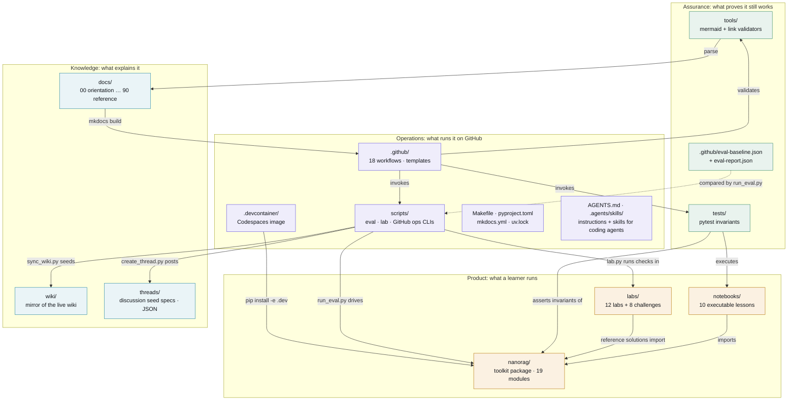

---

## Level 1: system context

Who uses nanorag, and what does it reach outside itself?

Nothing outside nanorag is needed at runtime. PyPI is needed once, at install time, and
GitHub hosts the course around the code. Amazon Bedrock, the Claude API, Hugging Face and
MultiHop-RAG connect through the interfaces the offline defaults already implement: `Hit`,
`BaseEmbedder`, `.rerank()` and `BaseGenerator`. Swapping one in changes the retriever or the
reader. The harness, the metrics and the eval set stay the same.

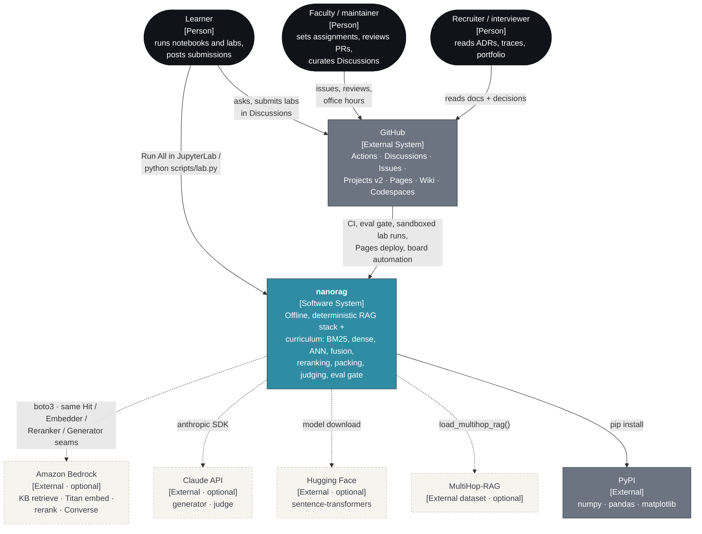

---

## Level 2: containers

A container here is anything that runs or holds data on its own. The retrieval store and the
trace store live inside the Python process, but they have their own schema and lifecycle, so
they get their own boxes. The lab sandbox and the eval gate runner exist only on a GitHub
runner.

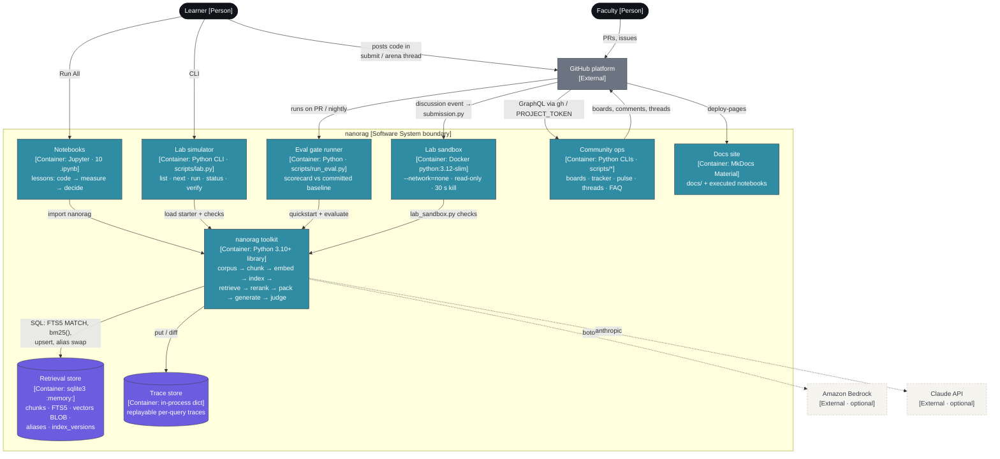

| Container | Technology | Entry point | State |
|---|---|---|---|
| nanorag toolkit | Python ≥3.10, numpy, pandas, matplotlib | `nanorag.quickstart()` | none; seeded with `bootstrap.SEED` |
| Retrieval store | sqlite3 `:memory:`, FTS5 with `tokenchars '_-'` | `store.InMemoryIndex` | gone when the kernel stops |
| Trace store | in-process | `trace.TraceStore` | per session |
| Notebooks | JupyterLab | `make lab` | outputs stripped before commit |
| Lab simulator | Python CLI | `scripts/lab.py` | progress derived from the checks, never stored |
| Eval gate runner | Python CLI | `scripts/run_eval.py` | `.github/eval-baseline.json` |
| Lab sandbox | Docker `python:3.12-slim` | `scripts/lab_sandbox.py` | read-only, tmpfs `/tmp` |
| Community ops | Python + `gh` GraphQL | `scripts/pulse.py`, `tracker.py`, `boards.py`, … | GitHub Projects v2 and Discussions |
| Docs site | MkDocs Material + nbconvert | `mkdocs build` | GitHub Pages |

---

## Level 3: components

### Inside the toolkit

These are the layers from the [module map](overview.md#module-map). Arrows follow the data: a
document becomes chunks, then vectors, then index rows, then hits, packed context, an answer,
a trace and finally metrics. `pipeline` is the only module that touches every layer on the
query path.

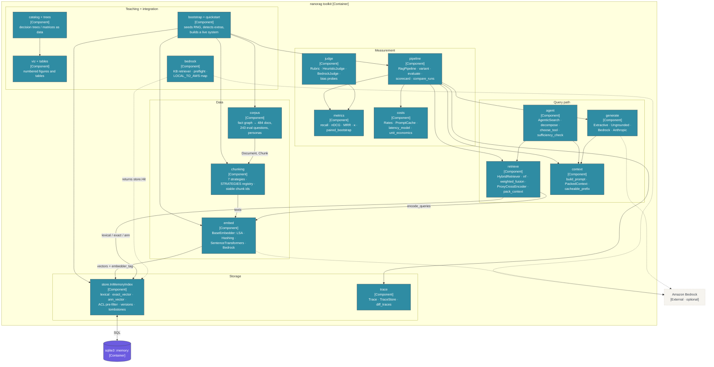

### Inside the GitHub automation

Each workflow is a thin wrapper around a script, and every script that writes to GitHub goes
through `boards.py` or `gh.py`. `PROJECT_TOKEN` goes only to the steps that write to the
user-owned Projects boards.

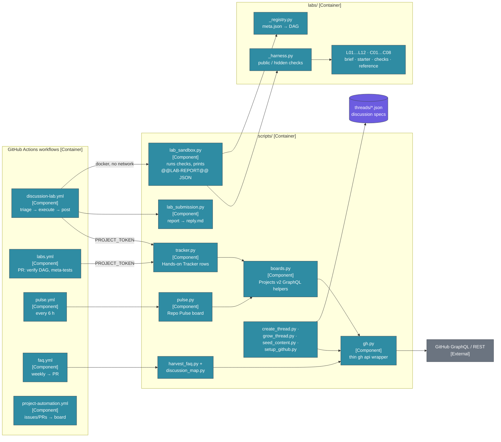

---

## Level 4: code

### Query-path classes

The swappable interfaces are `BaseEmbedder`, `BaseGenerator` and the reranker protocol. The
reranker protocol has no base class in the code; it is duck-typed, and the diagram draws it as
an interface. `RagPipeline` receives its index and embedder and never imports `store`, so a
Bedrock Knowledge Base retriever that returns `Hit` can replace the local index.

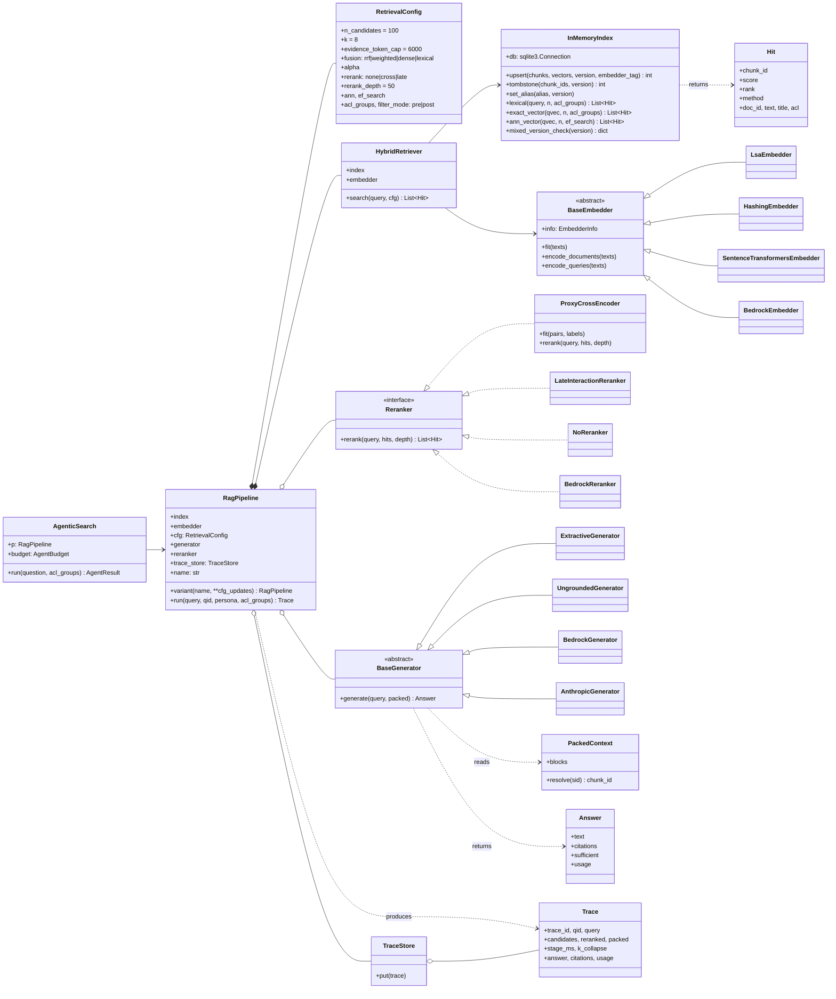

### Retrieval store schema

Taken from `store.SCHEMA`. Blue/green deployment is rows in `index_versions` plus a pointer in
`aliases`. `embedder_tag` is the only thing that catches a mixed-encoder index, because cosine
returns well-formed scores for vectors from two different models.

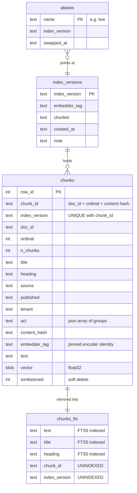

---

## Building-block view

Level 1 is the [repository layout](#repository-layout) diagram. Level 2 opens the package and
shows its real import graph, read from the `from .x import` lines. There are no cycles, and
seven leaf modules import nothing else from the package, so each can be read or replaced on
its own. The seams where new techniques plug in are in
[overview.md](overview.md#the-seams--where-to-plug-things-in).

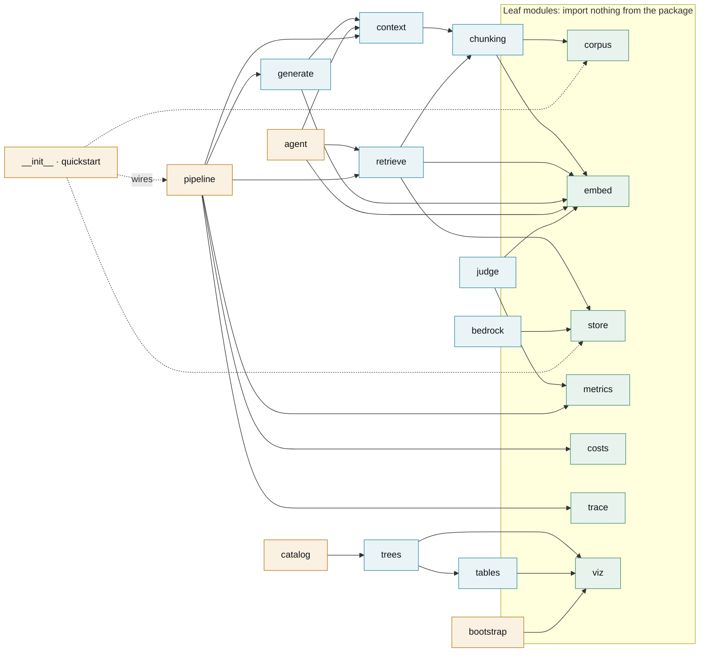

---

## Runtime view

Six runtime paths matter. Two run in the learner's kernel (R1, R2), two run on GitHub (R3,
R4), and two are control loops inside the toolkit (R5, R6).

### R1: cold start with `quickstart()`

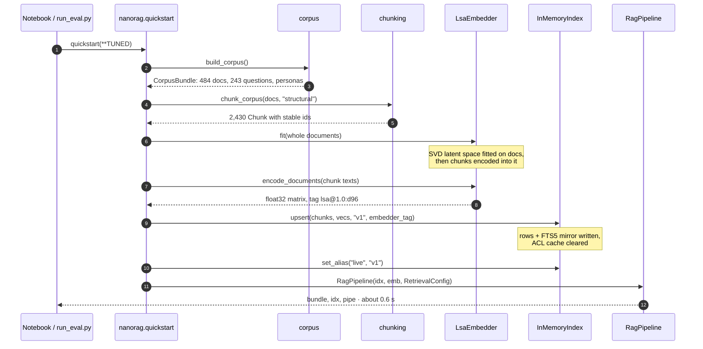

### R2: one query through `RagPipeline.run()`

Each stage is timed into `stage_ms`. `trace_id` is a UUID5 of the pipeline name, the qid and
the query, so re-running a query produces the same id and two runs can be diffed with
`diff_traces`.

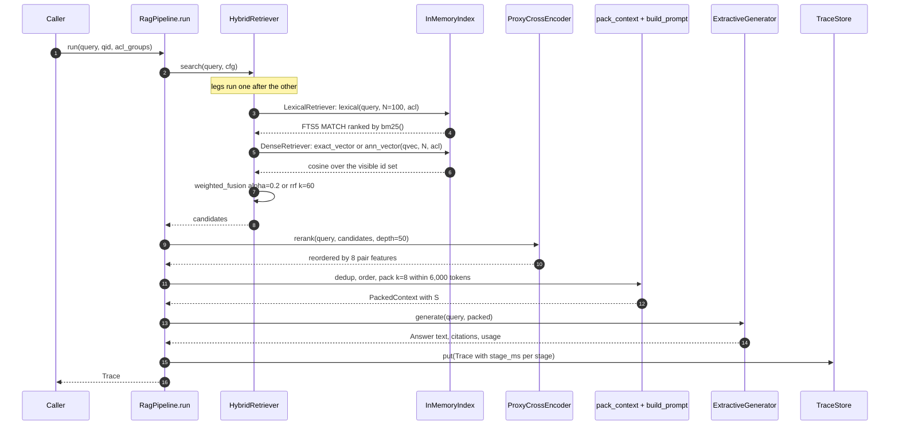

### R3: the release gate on a pull request

The tolerances live in `scripts/run_eval.py`: evidence recall may drop by 0.02, full-chain
recall by 0.03 and answer correctness by 0.03. The frozen slice is reported on every run and
is never gated or tuned against. [ADR-0008](../20-decisions/0008-eval-gate-in-ci.md) records
why the gate is in CI.

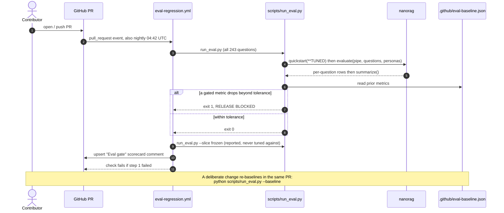

### R4: a lab submission from a Discussion comment

Anyone can comment on a public discussion, so the comment body is untrusted. The job that runs
the code has no token and no network. The job that holds a write token never sees the code;
it reads a JSON report. The body reaches disk through an environment variable and never
appears on a shell command line. The security header of `.github/workflows/discussion-lab.yml`
has the full reasoning.

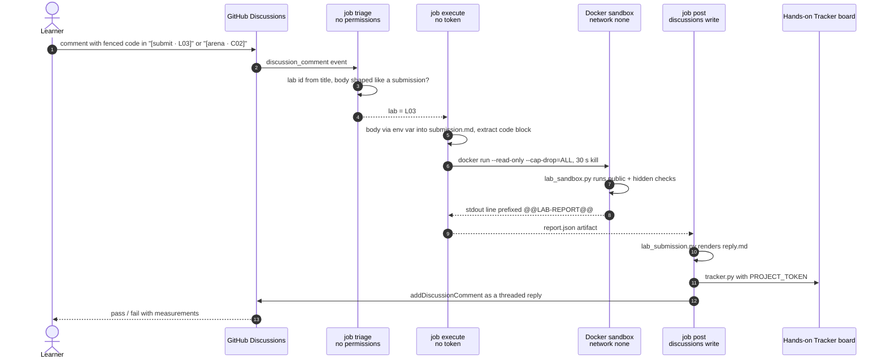

### R5: the agentic search loop

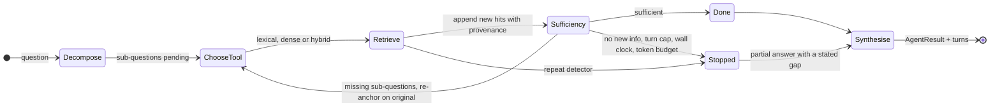

### R6: the index lifecycle

The incremental path handles an edited document. The rebuild path handles an encoder, chunker
or analyzer change. [ADR-0004](../20-decisions/0004-stable-chunk-ids.md) explains why stable
chunk ids keep the incremental path cheap.

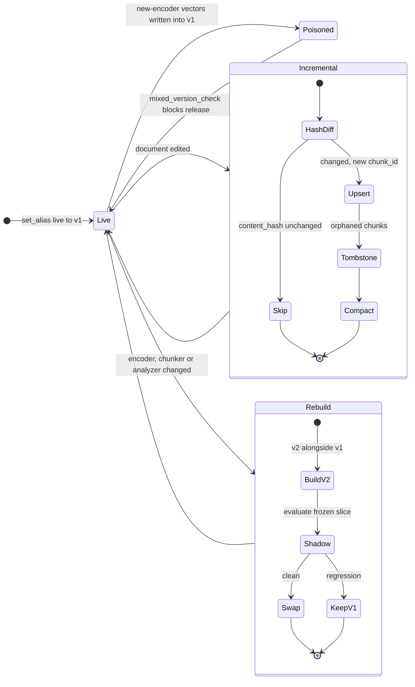

---

## Deployment view

There is no server. Production is whatever runs the Python kernel: a laptop or a Codespace.
GitHub runs everything else, which is testing the code, publishing the docs and running the
course.

```mermaid
flowchart TB
    subgraph DEV["Learner machine or GitHub Codespace [Node]"]
        direction TB
        subgraph CTR["Dev container: python:1-3.12-bookworm + Node 20 + gh [Execution env]"]
            JL["JupyterLab :8888"]
            KER["Python kernel<br/>nanorag + numpy · pandas · matplotlib"]
            SQL[("sqlite3 :memory:<br/>FTS5 compiled in, asserted at create")]
            CLI["scripts/lab.py · make check"]
        end
    end

    subgraph RUN["GitHub-hosted runner: ubuntu-latest [Node]"]
        direction TB
        CI["CI · Tests py3.10-3.12 · Coverage · CodeQL"]
        NBW["Notebooks · matrix of 10, nightly 03:17"]
        EG["Eval gate · PR + nightly 04:42"]
        LBW["Labs · Diagrams · Markdown · Links"]
        PGB["Pages build<br/>mkdocs + nbconvert --execute"]
        subgraph SBX["Docker: python:3.12-slim [Execution env]"]
            LSB["lab_sandbox.py<br/>no network · read-only · uid 65534<br/>256 MB · 1 CPU · 64 pids"]
        end
        OPS["pulse every 6 h · faq weekly ·<br/>stale · welcome · labeler · board"]
    end

    subgraph GHP["GitHub platform [Node]"]
        REPO[("Repository main")]
        DISC["Discussions"]
        PROJ["Projects v2<br/>delivery · tracker · pulse · lifecycle"]
        PAGES["GitHub Pages<br/>akash-coded.github.io/nanorag"]
        WIKI["Wiki<br/>canonical, mirrored in wiki/"]
    end

    subgraph AWS["AWS account + region [Node · optional]"]
        BRK["Bedrock runtime<br/>Titan embed · rerank · Converse"]
        KB["Bedrock Knowledge Base"]
    end
    ANT["api.anthropic.com [optional]"]

    KER --- SQL
    JL --> KER
    CLI --> KER
    DEV -->|"git push / PR"| REPO
    REPO -->|"workflow triggers"| RUN
    DISC -->|"discussion_comment"| SBX
    OPS -->|"PROJECT_TOKEN"| PROJ
    PGB -->|"deploy-pages"| PAGES
    EG -->|"scorecard comment"| REPO
    KER -.->|"boto3, AWS credentials"| BRK
    KER -.-> KB
    KER -.->|"ANTHROPIC_API_KEY"| ANT
    CLI -.->|"make wiki-pull"| WIKI

    classDef node fill:#F6F4EF,stroke:#3A414B,color:#101318
    classDef run fill:#2F8CA3,stroke:#3A414B,color:#FFFFFF
    classDef store fill:#6C5CE0,stroke:#3A414B,color:#FFFFFF
    classDef sand fill:#CF4F35,stroke:#3A414B,color:#FFFFFF
    classDef opt fill:#F6F4EF,stroke:#C9C4B8,color:#3A414B,stroke-dasharray: 4 3
    class JL,KER,CLI,CI,NBW,EG,LBW,PGB,OPS run
    class SQL,REPO store
    class LSB sand
    class DISC,PROJ,PAGES,WIKI run
    class BRK,KB,ANT opt
```

| Workflow | Trigger | What it checks or does |
|---|---|---|
| `ci.yml` | push, PR | ruff; pytest on Python 3.10, 3.11 and 3.12; install on a fresh machine |
| `notebooks.yml` | push, PR, nightly 03:17 UTC | all ten notebooks execute, one matrix job each |
| `eval-regression.yml` | PR, nightly 04:42 UTC | release gate and frozen slice; posts the scorecard on the PR |
| `labs.yml` | PR | lab DAG is valid; references pass and starters fail; updates the tracker |
| `discussion-lab.yml` | discussion, discussion comment | sandboxed lab grading and a threaded reply |
| `pages.yml` | push to `main` touching docs, notebooks or the package | MkDocs site plus executed notebooks, deployed to Pages |
| `diagrams.yml`, `markdown.yml`, `link-check.yml` | push, PR; links also weekly | every Mermaid block parses; markdownlint; no dead relative links |
| `coverage.yml`, `codeql.yml` | `main` and PR; CodeQL also weekly | coverage with `bedrock.py` omitted; security scan |
| `pulse.yml`, `faq.yml` | every 6 hours; weekly | Repo Pulse board; FAQ and discussion map opened as a PR |
| `project-automation.yml`, `labeler.yml`, `semantic-pr.yml`, `welcome.yml`, `stale.yml` | issues, PRs, weekly | board routing, labels, PR-title check, greetings, stale sweep |

---

## Updating this page

Change a diagram in the same PR as the code it describes. The usual triggers are a new module
or seam implementation (Level 3, Level 4 and the import graph), a new workflow (the deployment
table) and a new external dependency (Level 1). Run `node tools/validate-mermaid.mjs` or
`make check` before pushing. Node colours come from the palette in `nanorag/viz.py`, as in the
README and overview.md.
