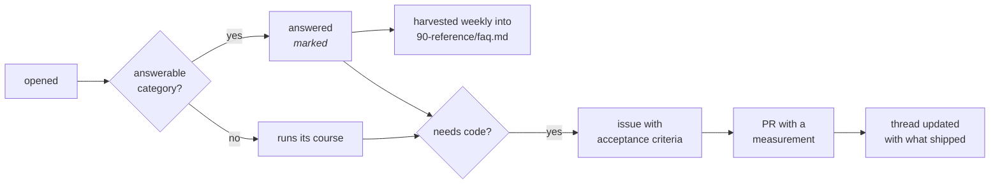

# Discussions

Nine categories, eight title prefixes, one rule underneath all of them:

> **Evidence beats adjectives.** A post with a number in it gets answered in one round trip. A
> post without one takes three, and usually the first two are people asking what you measured.

**[Open Discussions →](https://github.com/akash-coded/nanorag/discussions)**

---

## Where does this go?

Start at the top and stop at the first row that matches.

| I want to… | Post in | Prefix |
|---|---|---|
| ask about a specific **exercise** I am stuck on | Q&A | `[clinic · EX-NN]` |
| ask about a specific **lab** | Q&A | `[lab · TN]` |
| say the **material is wrong** or overconfident | Q&A | `[errata]` |
| follow a **derivation** I cannot get through | Q&A | `[maths]` |
| ask anything else that has an answer | Q&A | — |
| **submit** a finished exercise, with numbers | Show and Tell | `[solution · EX-NN]` |
| report something I measured **and rejected** | Show and Tell | `[negative result]` |
| show a finished **capstone** | Show and Tell | `[capstone]` |
| get a **design torn apart** before I build it | Design Reviews | — |
| practise an **interview answer** | Interview Prep | — |
| run or read a full simulated **interview loop** | Interview Prep | `[round · shape]` |
| argue about a **paper** | Reading Club | — |
| propose something that does not exist yet | Ideas | — |
| ask people to **predict** before a reveal | Polls | `[poll]` |
| announce a release, a cohort, an **office hours** | Announcements | `[office hours · date]` |
| introduce myself, ask about tooling or careers | General | — |

**When two rows fit, take the higher one.** A question about a paper you are stuck on is Q&A;
Reading Club is for arguing about a paper you have read.

## Why prefixes exist at all

GitHub has no API for creating discussion categories — there is no category mutation in the
GraphQL schema, and creating one is a manual settings action. This repository has nine.

Rather than leave the structure unbuilt, some kinds of thread carry a **title prefix and a
matching label**, which together do what a tenth category would have done: make a set findable,
filterable, and distinguishable at a glance.

| Prefix | Category | Label | Filter |
|---|---|---|---|
| `[clinic · EX-NN]` | Q&A | `clinic` | [→](https://github.com/akash-coded/nanorag/discussions?discussions_q=label%3Aclinic) |
| `[lab · TN]` | Q&A | `lab` | [→](https://github.com/akash-coded/nanorag/discussions?discussions_q=label%3Alab) |
| `[maths]` | Q&A | `maths` | [→](https://github.com/akash-coded/nanorag/discussions?discussions_q=label%3Amaths) |
| `[errata]` | Q&A | `errata` | [→](https://github.com/akash-coded/nanorag/discussions?discussions_q=label%3Aerrata) |
| `[solution · EX-NN]` | Show and Tell | `solution` | [→](https://github.com/akash-coded/nanorag/discussions?discussions_q=label%3Asolution) |
| `[negative result]` | Show and Tell | `negative-result` | [→](https://github.com/akash-coded/nanorag/discussions?discussions_q=label%3Anegative-result) |
| `[capstone]` | Show and Tell | `capstone` | [→](https://github.com/akash-coded/nanorag/discussions?discussions_q=label%3Acapstone) |
| `[round · shape]` | Interview Prep | `interview-round` | [→](https://github.com/akash-coded/nanorag/discussions?discussions_q=label%3Ainterview-round) |
| `[office hours · date]` | Announcements | `office-hours` | [→](https://github.com/akash-coded/nanorag/discussions?discussions_q=label%3Aoffice-hours) |
| `[poll]` | Polls | `poll` | [→](https://github.com/akash-coded/nanorag/discussions?discussions_q=label%3Apoll) |

**The label is the reliable filter.** A title can be edited by accident; a label cannot.

**A prefix earns its place only when it distinguishes threads *within* a category.** "Design
review:" inside Design Reviews is noise. `[negative result]` inside Show and Tell is not, because
that category also holds capstones and solutions.

---

## The nine categories

### Q&A · answerable

The workhorse, and the only category where the **Mark as answer** mechanic applies.

**Belongs here:** anything with a determinate answer. Stuck on an exercise or lab, a derivation
you cannot follow, a number that disagrees with the docs, a mechanism you cannot explain.

**Does not belong here:** opinions, proposals, and "what do people think about X" — those are
General or Ideas. A question with no possible answer clutters the answered/unanswered filter,
which is the only triage signal this category has.

**A good post carries:** the numbers you got, the config that produced them, and what you already
tried. See [asking well](#asking-a-question-that-gets-answered-once) below.

**The clinic threads are pinned per exercise.** Ask there rather than opening a new thread — the
answers accumulate where the next person will look. That is the difference between a support
queue and a knowledge base.

### Show and Tell · open

Finished work, **with numbers**. Three shapes, distinguished by prefix.

**`[solution · EX-NN]`** — an exercise submission. Must include your numbers, your interval, and
**what you tried that did not work**. The last is not decoration: a submission that reports only
the winning path teaches nobody the search.

**`[negative result]`** — something you measured and rejected. Full credit, and often the most
useful thing in the category. State the **mechanism you tested**, not the technique you were
inspired by: *"contextual chunking does not work"* is unfalsifiable; *"prepending already-present
metadata to chunks that already carry a heading path did not improve recall on this corpus, at
2.4× storage"* is a claim someone can check and reuse.

**`[capstone]`** — an end-to-end build with a decision record.

**Reviewers reply with a measurement, not an opinion.** "I'd have done it differently" is not a
review. "Here is the number that would change your conclusion" is.

### Design Reviews · answerable

Constraints in, design out, critique in the middle. An RFC that has not been built yet.

**A good post carries:** the constraints that make it hard — latency, cost ceiling, residency,
ACL cardinality, corpus size, team size, timeline — **before** the design. A design posted
without its constraints cannot be reviewed, only admired.

**Reviewers:** run the [design review checklist](../60-cheatsheets/playbooks/design-review-checklist.md).
Say explicitly which parts survive review; a review that lists only problems reads as a verdict
on the person rather than on the design.

**The answer gets marked** when the thread reaches a decision, and the marked answer should
contain the synthesis — what was accepted, what was rejected, and what is still open.

### Interview Prep · answerable

Two shapes.

**Answer critique** — post an answer you want torn apart. **A self-critique is mandatory.** An
answer posted without one gets the critique you already knew about, which wastes everyone's turn.

**`[round · shape]`** — a full simulated loop: the prompt as it would be given, the clarifying
questions that are scored, the trap, a model answer, and a rubric table. Not a single question.
These are written to be read by someone preparing tomorrow.

### Reading Club · answerable

One paper per thread. The house position:

> **Replicate, do not cite.** A paper we can re-run against this corpus is worth far more argued
> about with numbers than without.

**A good post carries:** the claim in one paragraph, **how we would test it here** (which
notebook, which cell, which metric), and two or three things to argue about. If it cannot be
tested against this corpus, say so — that is a finding about the paper's scope, not a reason to
skip the thread.

### Ideas · open

Pre-issue. An idea that survives the thread becomes an issue with acceptance criteria; one that
does not is still a useful record of something considered and rejected.

**A good post carries:** the **problem** first, not the technique. Ideas that begin with a
technique usually do not survive contact with [The Precondition
Test](../60-cheatsheets/frameworks/precondition-test.md). Then: which metric moves, and by how
much would it have to move to be worth the cost.

### Polls · poll format

Calibration. Ask people to **predict before the reveal** — the gap between the vote and the
measurement is the teaching content, and it evaporates if you post the answer first.

**The reveal protocol**, because a poll with no reveal is a survey:

1. Post the scenario with the numbers people need to decide, and no more.
2. Leave it open at least a week.
3. Post the measurement **as a reply**, not by editing the body — editing destroys the record of
   what people were asked.
4. Say what the distribution of votes tells you, including when it says nothing.

### Announcements · announcement format

Releases, cohort kickoffs, errata roll-ups, and office hours.

**`[office hours · YYYY-MM-DD]`** — one dated thread per session. Agenda before, notes after, and
the thread **stays open**, so the answers are findable by whoever hits the same thing in three
months.

**An announcement that implies an action must name it.** If the answer is "nothing to do", say
nothing to do.

### General · open

Everything that does not fit and does not have an answer. Introductions, tooling, careers,
opinions, war stories, link round-ups.

**This is not a dumping ground.** If your post has an answer, it belongs in Q&A, where the
answered filter can find it later.

---

## Asking a question that gets answered once

The three things that turn three round trips into one:

```text
1. THE NUMBERS you got        not "recall got worse" — 0.807 → 0.752
2. THE CONFIG that produced   k, N, alpha, chunking strategy, slice, encoder
   them                       print RagConfig next to the metric, always
3. WHAT YOU ALREADY TRIED     including the thing that seemed obvious and failed
```

**And the thing most people omit: what you expected.** *"I expected widening N to move full-chain
recall and it did not"* tells a reader which mental model to correct. *"Full-chain recall did not
move"* tells them a fact they now have to guess the significance of.

**Before posting, check the clinic thread for your exercise.** Roughly half of new Q&A threads
are already answered in one.

## Answering well

- **Answer the question that was asked**, then the better question underneath it, in that order.
  Reversing them reads as a lecture.
- **Bring a measurement.** "I have seen this fail" beats "I would not do that", and both beat
  seniority.
- **Say what is still open.** An answer that resolves everything is usually hiding something.
- **Be willing to be wrong in public.** The threads worth reading here are the ones where
  somebody changed their mind on evidence.

## Thread lifecycle



**Answered threads are harvested weekly** into [`90-reference/faq.md`](../90-reference/faq.md) by
the [FAQ workflow](https://github.com/akash-coded/nanorag/blob/main/.github/workflows/faq.yml).
It links rather than copies: the thread stays the source of truth, because it carries the argument
that got there, which is usually the more useful half.

**Closing the loop is not optional.** If a thread produces an issue, say so *in the thread* with
the issue number. If the issue produces a PR, say what shipped. A thread that quietly stops is
indistinguishable from one nobody read.

## Duplicates, supersession and disagreement

**Duplicates** are not deleted. They are linked to the canonical thread and closed with a comment
naming it — someone searched those words once, and they will again.

**Superseded threads** get a comment at the top of the answer explaining what changed and linking
forward. A thread whose answer is now wrong and says nothing is worse than no thread.

**Disagreement resolves on evidence, never on authority.** The maintainer does not win an argument
by being the maintainer. If a thread ends with someone deferring rather than measuring, it is a
bad thread regardless of who was right.

**Moderation** is light and stated: off-topic gets moved, not deleted. Anything that violates the
[Code of Conduct](https://github.com/akash-coded/nanorag/blob/main/CODE_OF_CONDUCT.md) is removed
and said so.

## Casebook threads

Some threads are **reconstructed conversations written for teaching**, published by the
maintainer with illustrative roles. They carry a banner and the `casebook` label.

Every number in one is reproducible from a named cell in this repository. Roles are illustrative;
results are not. The full convention, including the fixed role vocabulary and why this is done
openly rather than with additional accounts, is in
[casebook-convention.md](casebook-convention.md).

## What not to post

- **A question with no numbers**, when you have numbers. It costs everyone two turns.
- **A technique with no problem.** "Should we use X?" → what failure does it fix, and do we have
  it?
- **A benchmark result with no interval.** A point estimate is not a result.
- **Anything confidential.** Client corpora, real customer questions, internal metrics. Threads
  here are public and permanent.
- **A new thread when a clinic thread exists.** Ask there.

## Good first discussion

New and want to contribute something useful in fifteen minutes?

1. Run a lab, and post in its **track thread** what the check messages did not make obvious. Bad
   check messages are bugs and saying so is a real contribution.
2. Take a **paper from the reading list** you have actually read, and open a Reading Club thread
   with a replication plan.
3. Find a number in the docs you can reproduce, reproduce it, and post `[errata]` if it does not
   match.

The third is the highest-value thing a newcomer can do here, and it is how
[#85](https://github.com/akash-coded/nanorag/discussions/85) happened.
