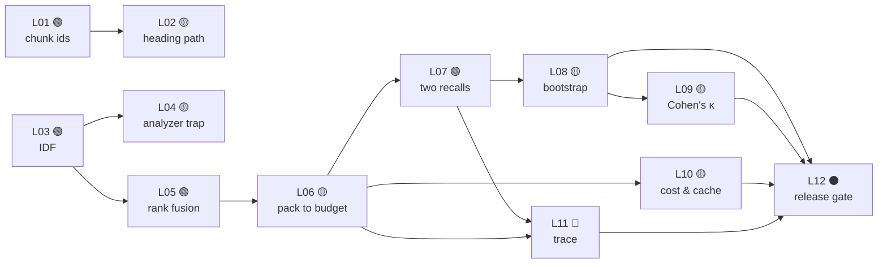

# L.A.B. simulator

**L**ook · **A**ttribute · **B**uild.

Twelve labs, eight tracks, one loop. Each is 15–50 minutes, each ends in code that either passes
its checks or does not, and each one puts a **decision** in front of you before it lets you type.

## Run it with nothing installed

[](https://codespaces.new/akash-coded/nanorag?quickstart=1)

One click. The container installs the toolkit, checks your SQLite has FTS5 — the lexical leg *is*
FTS5, so a Python without it fails three notebooks in — verifies the pathway, and opens the brief
beside the file you edit.

```bash
python scripts/lab.py open L01      # brief on one side, starter on the other
python scripts/lab.py run L01       # public checks
python scripts/lab.py run L01 --hidden
python scripts/lab.py next          # what you can start right now
python scripts/lab.py status        # how far through you are
```

**In the editor, `Ctrl/Cmd+Shift+B` runs the lab whose file you have open.** Not a lab you have to
name — the one you are looking at. Other tasks are on the command palette under *Run Task*.

Prefer local? The same commands work after `make setup`.

**[Or read the labs on GitHub →](https://github.com/akash-coded/nanorag/tree/main/labs)**

---

## Why this is not a problem set

A code kata gives you a spec and a test. You satisfy the test. You learn the API.

That is not where retrieval engineers actually fail. They fail by **adopting a technique that
fixes a problem they do not have**, by **shipping on a metric that moved inside the noise band**,
and by **choosing a design whose consequences arrive two quarters later**. None of those are
typing problems, and none of them show up in a spec-and-test format.

So every lab runs the same three beats:

| | | |
|---|---|---|
| **Look** | You are given **evidence**, not a description | A table, a trace, a curve. Something with numbers in it |
| **Attribute** | You commit to a **decision** before writing anything | 3–4 options, each defensible under some constraint. The wrong ones are wrong for a *reason* |
| **Build** | You implement the consequence, and **measure** it | Checks report a number, not only a verdict |

The decision is the part most practice material skips, and it is the part interviews are actually
about. A lab where there is one right answer and you type it teaches you an API. A lab where you
had to choose, and the checks encode *why* that choice, teaches you the judgement.

## Two sizes: challenges and labs

Labs are 15–50 minutes and ask for a decision. That is the right size for learning judgement
and the wrong size for a first contact with a mechanism — so underneath every lab sit
**challenges**: 5–15 minutes, one mechanism, one of four shapes.

| Shape | What you get | What you do |
|---|---|---|
| `implement` | a spec and a stub | write the function |
| `fill` | working code with `____` blanks | fill them — the blanks are the *decision points* |
| `fix` | complete code with a planted bug | make the checks pass with the smallest change |
| `predict` | a table or a trace, and no code | submit the number or verdict the run will produce |

The shapes exist because "implement this function" is only one way to find out whether somebody
understands a thing. `fix` tests whether you can *read*; `predict` tests whether you can reason
without running anything, which is what a design review actually demands.

**Each challenge derives from one notebook section** — the brief names it — and **unlocks a
lab**. Finish `C03` (predict IDF's sign) and `next` hands you `L03` (find the exact pivot), with
the reason it comes next. Challenges are the on-ramp, not a gate: nobody partway through the labs
is walled off by them.

A fill-format starter imports cleanly with its blanks unfilled — the harness binds `____` to a
placeholder — so every check gets to say, in the mechanism's own terms, what the blank costs:
*"expected 4 sentences, got 1"*, not a `NameError`.

## Public checks and hidden checks

Every lab splits its checks in two.

**Public checks** are described in the brief. They tell you whether you understood the task.

**Hidden checks** run on `--hidden` and cover what the brief deliberately did not mention — empty
input, a duplicate id, a boundary, a degenerate config. Passing the public set and failing the
hidden one is the normal experience.

> **The gap between them is the lesson.** It is where the brief's assumptions were doing work you
> did not notice they were doing. Production is the hidden set.

## Checks report measurements, not just verdicts

A test that says *pass* teaches you to satisfy a test. A check that says

```text
pass  packs under a hard budget
      6/8 chunks, 574/600 tokens (26 slack)
```

teaches you that correctness was the easy half. Several labs pass with a number you should be
unhappy about, and the debrief tells you why.

## The eight tracks, and the lifecycle underneath them

The tracks are ordered by dependency, not by topic. They also walk a product development
lifecycle — **not as a section bolted on the end, but because each track's capstone produces the
artefact that stage actually hands to the next person.**

| Track | | Lifecycle stage | The artefact you produce |
|---|---|---|---|
| **T1** | Corpus & Chunking | Discovery | A corpus spec: what is in scope, what the retrievable unit is |
| **T2** | Indexing & Retrieval | Design | An ADR: the retrieval design, and the alternative that lost |
| **T3** | Ranking & Packing | Development | An implementation with a measurement attached |
| **T4** | Measurement | Testing | An eval set, and the noise band that makes it interpretable |
| **T5** | Judgement | Quality | A quality gate somebody else can run without you |
| **T6** | Economics | Viability | A cost model whose inputs are named |
| **T7** | Agents & Traces | Operations | A trace that makes a failure reproducible after the fact |
| **T8** | Shipping | Release | A decision record: ship, do not ship, or not yet measurable |

You do not learn a lifecycle by reading a diagram of it. You learn it by being made to produce
its outputs, in the order the next stage needs them, and discovering what goes wrong when one is
missing. **L12 cannot be completed without T4's noise band, T5's calibrated judge, T6's cost
model and T7's trace** — the prerequisite graph enforces it, because that dependency *is* the
lesson.

## The pathway

Prerequisites are a DAG, validated in CI. `python scripts/lab.py next` reads it and tells you
what is unlocked.



**Two entry points.** `L01` if you think in data. `L03` if you think in scoring. They converge at
T3 and stay converged.

## Progress is derived, never stored

There is no progress file. `status` runs the checks and reports what passes.

Nothing can drift out of sync with your code, nothing can be marked complete that does not
actually work, and a fresh clone tells you the truth immediately. It is the same argument the
rest of this repository makes about measurement, applied to the learner.

## Submitting from a discussion

Every lab has a **submission thread** in Show and Tell, prefixed `[submit · LNN]`. Paste your
solution in a fenced Python block and a workflow replies within about a minute.

**The review reads your code with Python's AST. It does not run it, deliberately.** Anyone can
comment on a public discussion, and a workflow that executes code from a comment is remote code
execution on the runner — no amount of permission tightening changes that the code ran. So the
automatic review checks what static analysis can honestly check:

- the required functions exist, with the right names
- you have not pasted the starter back
- nothing is hardcoded from the brief's own examples
- on the measurement tracks, the write-up carries an **interval**, not a point estimate

That is most of what a first submission needs, and it arrives in seconds. For the real checks —
including the hidden ones — run them in a Codespace, or open a pull request.

## Auto-evaluation

Fork, fill in a lab's `starter.py`, open a pull request. The
[Labs workflow](https://github.com/akash-coded/nanorag/blob/main/.github/workflows/labs.yml)
runs that lab's checks — **public and hidden, because at pull-request time the attempt is already
submitted** — and posts a table of results, editing the same comment on each push rather than
piling up new ones.

It does **not** fail the build on red checks. A red ✗ on somebody's first contribution is a poor
way to teach, and the comment already says exactly what failed and why.

What the workflow *does* enforce, on every change:

- the pathway is still a valid DAG — no cycles, no dangling prerequisites
- **every reference solution still passes its own checks**, including hidden ones
- every starter still *fails* — a lab whose starter passes has nothing in it

## For whoever runs a session

Everything an instructor needs is a script or a board — nothing here needs a pull request.

```bash
python scripts/assign.py --session 2026-09-08 --items C03,C02,L03 \
    --to alice,bob,carol --due 2026-09-10 --announce
```

That creates one row per person per item on the
[Hands-on Tracker](https://github.com/users/akash-coded/projects/11) with `Outcome = Assigned`,
and `--announce` posts a session thread that @mentions everyone with the list and the Codespaces
button. When a learner submits — in an arena thread or on a PR — the same row moves:
`Assigned → Attempted → Retrying → Passed`, with the attempt count. **A row still *Assigned*
past its due date is the thing you actually need to see**, and a row on *Retrying* with four
attempts is someone to go and sit with.

The [Repo Pulse](https://github.com/users/akash-coded/projects/12) board refreshes every six
hours with unanswered Q&A older than 48 hours, hot threads, and arena activity. The full
walk-through — before, during, and the morning after — is the
[Session Runbook](https://github.com/akash-coded/nanorag/wiki/Session-Runbook) on the wiki, and
the [Arena FAQ](https://github.com/akash-coded/nanorag/wiki/Arena-FAQ) answers what learners ask
in the first ten minutes.

## Where a lab sends you next

Every brief ends with links into the rest of the repository: the ADR that decided it, the
discussion where it was argued out, the [framework](../60-cheatsheets/) it instantiates, or the
[derivation](../30-learning/interview-prep/01-mathematical-foundations/) behind it.

The labs are the doing. The rest of the repo is the why, and the two are wired together
deliberately — a lab you passed without reading its debrief is a test you satisfied.

## Adding a lab

Five files in `labs/L<NN>-<slug>/`: `meta.json`, `brief.md`, `starter.py`, `reference.py`,
`checks.py`. `python scripts/lab.py index` regenerates the index; CI enforces the rest.

The brief must have all four beats — Look, Attribute, Build, Debrief — and the Attribute section
must contain a real decision with **defensible wrong answers**. A decision whose alternatives are
obviously bad is not a decision, it is a quiz.
