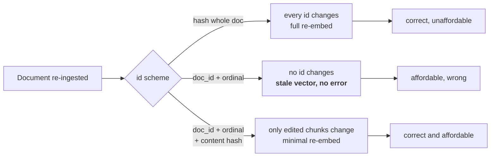

# L01 · Give a chunk an id that survives an edit

🟢 **Easy** · 15 min · Track T1 — Corpus & Chunking · no prerequisites

---

## Look

A document is ingested. It produces 40 chunks. Two weeks later somebody fixes a typo in
paragraph 19 and it is ingested again.

Here is what the index does under three different id schemes. **The only thing that changed in
the source is one word.**

```text
scheme                          ids changed   re-embedded   tombstoned
content hash of whole document       40            40            40
doc_id + ordinal                      0             0             0
doc_id + ordinal + content hash       1             1             1
```

Row one re-embeds a document nobody meaningfully edited. On a 40M-chunk corpus that is the
difference between a minute and a weekend.

**Row two is worse, and it is the one that looks correct.** Zero ids changed, so zero chunks
were re-embedded — including the one whose text is now different. The index still holds the old
text's vector under an id that now points at new text. Nothing errors. The chunk simply
retrieves for the wrong queries, quietly, until someone rebuilds.

## Attribute

The id is not a label. It is a **contract with the incremental update path**: it declares what
"the same chunk" means, and every re-ingest decision follows from it.



### The decision

Before writing anything, commit to one. Each is defensible under some constraint.

| | Scheme | Choose it when |
|---|---|---|
| **A** | `sha256(document text)` | Documents are small and rarely edited; simplicity beats cost |
| **B** | `f"{doc_id}:{ordinal}"` | Chunk boundaries never move **and** you rebuild on every ingest |
| **C** | `f"{doc_id}:{ordinal}:{hash(text)[:8]}"` | You have an incremental path and want it to stay incremental |
| **D** | `uuid4()` | Never. It is stable across nothing, including itself |

This lab builds **C**. The checks encode why: they assert that a one-word edit changes exactly
one id, which A fails by changing forty and B fails by changing none.

> **The trap in C** is the part people get wrong: hash the **normalised** text, not the raw text.
> If a re-ingest changes whitespace — a different PDF extractor, a trailing newline — raw hashing
> reports an edit that did not happen, and you are back to row one.

## Build

Open `starter.py` and implement `chunk_id`.

```bash
python scripts/lab.py run L01
```

Public checks tell you whether you understood the task. When they pass:

```bash
python scripts/lab.py run L01 --hidden
```

The hidden checks cover what the brief did not mention. **The gap between the two is the lesson.**

## Debrief

*Read after you pass.*

**Why the ordinal is still in there.** With the content hash alone, two identical paragraphs in
one document collide into one id — a legal document with repeated boilerplate clauses would lose
chunks silently. The ordinal disambiguates position; the hash detects change. Neither alone is
enough.

**What this buys you, concretely.** The tombstone-and-compact path in `nanorag/store.py` only
works if it can tell an *edited* chunk from a *moved* one. Scheme C makes an edit look like a
new id plus an orphaned old id, which is exactly what `tombstone()` is written to handle.

**What it costs.** Insert a paragraph at the top of a document and every ordinal below it shifts,
so every id changes. Scheme C is stable against *edits*, not against *insertions*. Fixing that
needs content-defined chunking, which is a different lab and a much larger hammer.

**The senior version of this answer.** In an interview, "I'd use doc id plus ordinal plus a
content hash" is a fine answer that gets a follow-up. The follow-up is *"what happens when
someone inserts a paragraph at the top?"* — and the answer that scores is naming the limitation
before they ask.

---

**Decides:** [ADR-0004](../../docs/20-decisions/0004-stable-chunk-ids.md) ·
**Next:** L02 — structural chunking that keeps the heading path
