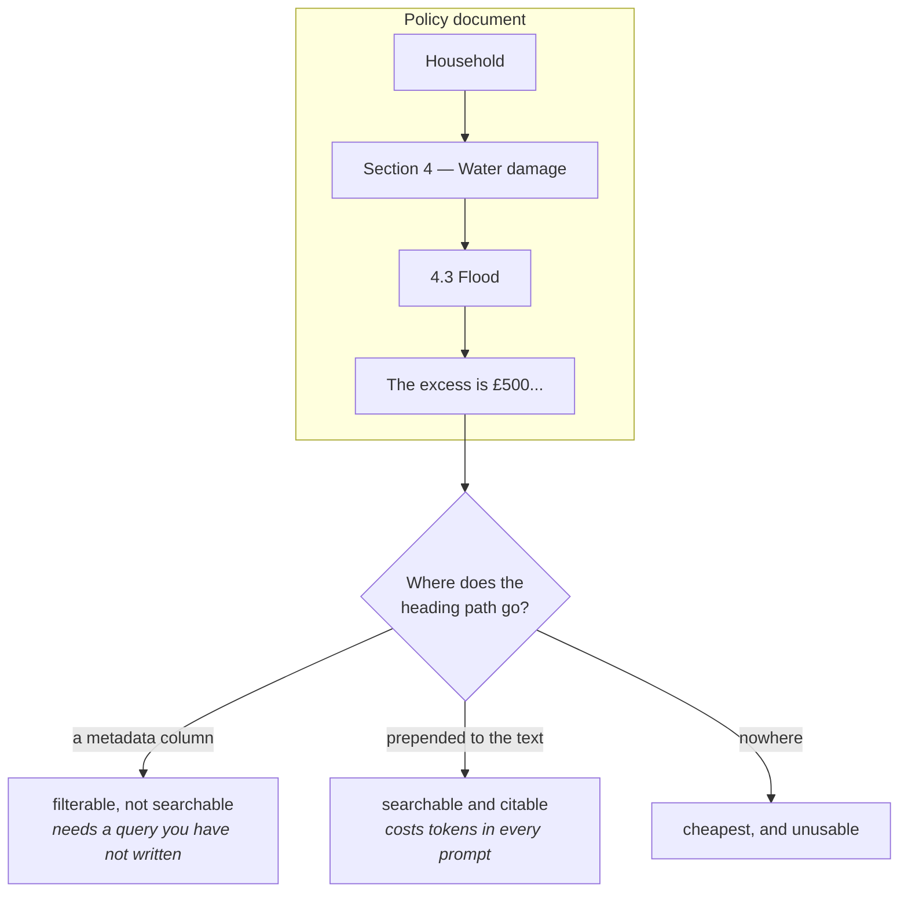

# L02 · Carry the heading path into every chunk

🟡 **Medium** · 25 min · Track T1 — Corpus & Chunking · after L01

---

## Look

Two chunks from the same 40-page policy document, retrieved for the query
*"what is the excess on a flood claim?"*

```text
chunk A   "The excess is £500 per incident, rising to £2,500 where the
           property is in a designated flood zone."

chunk B   "§ Household › Section 4 — Water damage › 4.3 Flood
           The excess is £500 per incident, rising to £2,500 where the
           property is in a designated flood zone."
```

Same words. **Chunk A is unusable and chunk B is not**, for three separate reasons:

1. A cannot be **cited**. "The excess is £500" with no location is an assertion, and in a
   regulated setting an uncited assertion is worse than no answer.
2. A cannot be **disambiguated**. The same sentence appears in *Motor › 2.1 Accidental damage*
   with different numbers. Retrieval returns both and nothing distinguishes them.
3. A retrieves **worse**. The heading terms are query terms. Stripping them removes exactly the
   words a user searching for "flood excess" will type.

## Attribute

The instinct is to treat the heading as metadata — store it in a column, keep the chunk text
clean. That is wrong here, and the reason generalises:

> **Metadata is filterable. Text is retrievable.** A heading in a column can narrow a search you
> already know how to narrow. A heading in the text can *answer* a search.



### The decision

| | Where the path goes | Cost | Buys |
|---|---|---|---|
| **A** | Nowhere | free | nothing |
| **B** | A metadata column only | ~0 tokens | filtering, and attribution *if the caller thinks to ask* |
| **C** | Prepended to the chunk text | ~12 tokens per chunk, in every prompt | retrieval, citation and disambiguation, for free at query time |
| **D** | Both | ~12 tokens | C, plus filterable facets |

**This lab builds D**, and the reason is worth saying out loud: the two copies serve different
consumers. The text copy serves *retrieval and the reader*. The column serves *the filter and the
UI*. Storing it once and hoping is how you end up with a citation feature that needs a schema
migration.

> **The cost is real.** At `k=8`, twelve tokens of heading per chunk is ~96 tokens of every
> prompt spent on paths. On a 4,000-token budget that is 2.4%. Know the number; do not pretend
> it is free.

## Build

Implement `heading_path` and `chunk_with_path` in `starter.py`.

```bash
python scripts/lab.py run L02
python scripts/lab.py run L02 --hidden
```

## Debrief

*Read after you pass.*

**This is why contextual chunking did not help here.** [Discussion #37](https://github.com/akash-coded/nanorag/discussions/37)
measured contextual chunking — generating a sentence to situate each chunk — at 2.4× storage and
*worse* recall. The mechanism is this lab: structural chunking already carries the heading path,
so the chunks were never orphaned from their context. **Contextual chunking fixes a failure you
do not have once you have done L02.** That is [The Precondition Test](../../docs/60-cheatsheets/frameworks/precondition-test.md)
in one example.

**The separator matters more than it looks.** `›` is not in the analyzer's token set, so it does
not become a searchable term and does not dilute IDF. A separator like `-` or `/` would — and
after L04 you will know exactly why that is a problem.

**Where this breaks.** Deeply nested documents produce paths longer than the chunk. A 6-level
heading path on a 40-token chunk is mostly path. Truncate from the *left* — the nearest headings
carry the most information, and the top-level one is usually the document title you already have.

---

**Next:** L03 — BM25's IDF term, by hand
