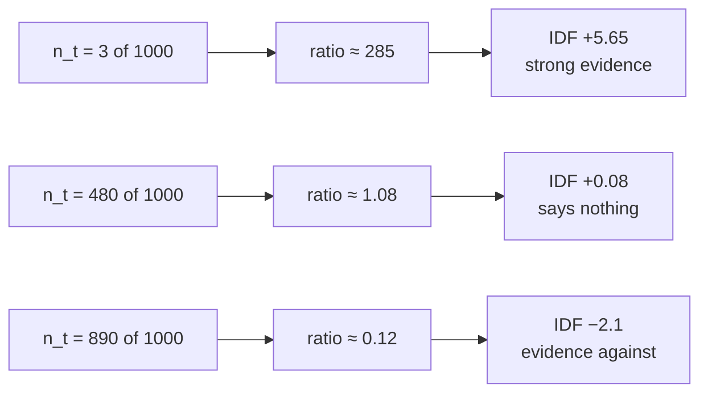

# L03 · Compute BM25's IDF, and find where it goes negative

🟢 **Easy** · 15 min · Track T2 — Indexing & Retrieval · no prerequisites

---

## Look

A 1,000-document incident corpus. Four terms, and what BM25's IDF assigns them:

```text
term            in n docs    IDF
ERR_CONN_RESET        3     +5.65
timeout             120     +1.99
service             480     +0.08
the                 890     -2.09     <- negative
```

Most people expect IDF to be a *penalty* that shrinks toward zero for common words. It does not
stop at zero. **It goes negative**, and a term in more than about half the collection actively
argues *against* relevance.

That is not a bug or a clamp somebody forgot. It falls out of what the number is.

## Attribute

IDF is not "one over document frequency dressed up in a log". It is the **log odds** that a
document containing the term is relevant, from the Robertson–Sparck Jones probabilistic model:

$$
\text{IDF}(t) = \log \frac{N - n_t + 0.5}{n_t + 0.5}
$$

Read the fraction as *documents without the term, over documents with it*. When more than half
the collection has the term, the numerator is smaller than the denominator, the ratio drops below
1, and the log is negative. **A term that nearly everything contains is weak evidence against
this document being the special one.**

That is also the principled version of a stop list: you do not need to maintain a list of words
to ignore, because the arithmetic already discounts them — and it discounts them *by corpus*,
which a hand-written list cannot.



### The decision

Real implementations disagree about the negative branch. Pick one before you write it:

| | Behaviour | Argument |
|---|---|---|
| **A** | Let IDF go negative | Faithful to the model. A ubiquitous term genuinely is counter-evidence |
| **B** | Floor at 0 | A term should never *reduce* a score. Lucene's classic default |
| **C** | Floor at a small ε | Keeps ranking stable when every query term is ubiquitous |

**This lab builds A**, because the whole point is to see the sign change. Ship B in production if
your stakeholders find negative contributions surprising — but know that you chose it.

## Build

Implement `idf` and `df_from_corpus` in `starter.py`.

```bash
python scripts/lab.py run L03
python scripts/lab.py run L03 --hidden
```

## Debrief

*Read after you pass.*

**The `0.5` terms are not decoration.** They are smoothing. Without them, a term in zero
documents divides by zero, and a term in *every* document takes the log of zero. The half-counts
make both branches finite, and they are why the formula is written with them rather than as the
textbook `log(N/n_t)`.

**Why this matters more than it looks.** IDF is computed from *your* corpus. Ingest a large batch
of documents that all mention "incident" and its IDF collapses — **the scores of queries you have
not changed will move.** That is one of the five causes in the
[incident runbook](../../docs/60-cheatsheets/playbooks/retrieval-incident-runbook.md), and it is
the one that looks like a model regression and is not.

**The interview follow-up.** After you derive this, the next question is *"so why does term
frequency saturate?"* — a different part of the same model, and the one in
[the BM25 derivation](../../docs/30-learning/interview-prep/01-mathematical-foundations/bm25-from-first-principles.md).

---

**Next:** L04 — the analyzer trap
