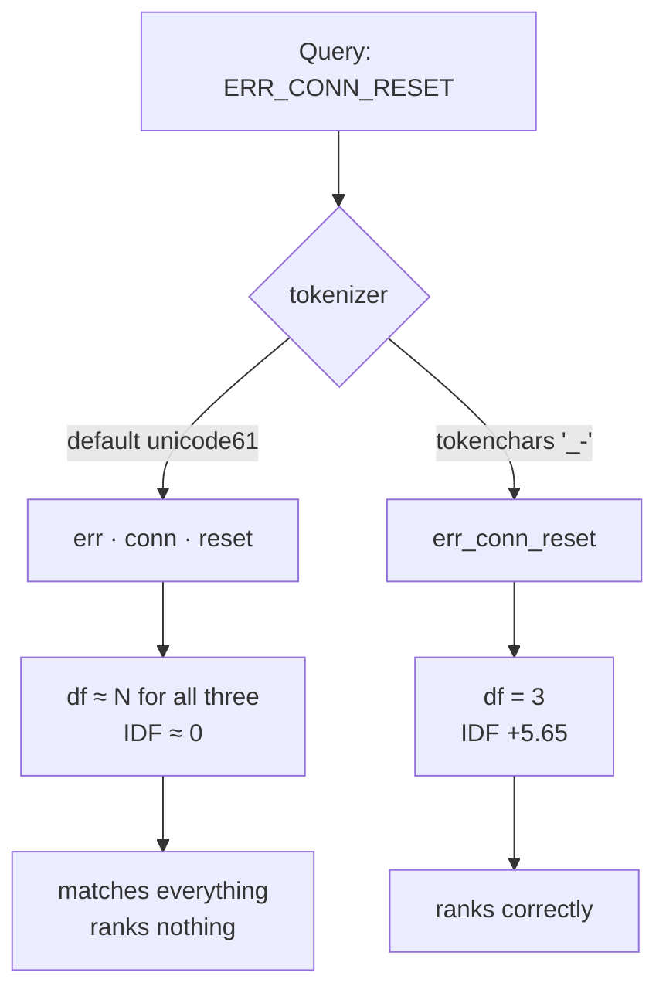

# L04 · Stop the tokenizer shredding your identifiers

🟡 **Medium** · 25 min · Track T2 — Indexing & Retrieval · after L03

---

## Look

Evidence recall by query class, lexical leg against dense leg. This is the real table from
[issue #1](https://github.com/akash-coded/nanorag/issues/1).

```text
query class          lexical   dense
identifier             0.778   0.856    <- inverted
pure lexical gap       1.000   0.200
prose                  0.831   0.795
```

Row one is backwards. `ERR_CONN_RESET` is the single easiest thing BM25 ever has to find — an
exact string, present in a handful of documents. It should not lose to a fifty-year-old dense
method.

Reproduced in four lines, with no error anywhere:

```python
db.execute("CREATE VIRTUAL TABLE t USING fts5(x)")          # default tokenizer
db.execute("INSERT INTO t VALUES ('ERR_CONN_RESET occurred')")
db.execute("SELECT count(*) FROM t WHERE t MATCH ?", ('"ERR_CONN_RESET"',))
# -> 0
```

The query runs. It returns results. They are the wrong results.

## Attribute

SQLite's default `unicode61` tokenizer treats `_` as a separator. `ERR_CONN_RESET` is indexed as
three terms — `err`, `conn`, `reset` — and each appears in **every incident report in the
corpus**. After L03 you can say exactly what happens next: their document frequency is near `N`,
so their IDF is near zero or negative, and a query made entirely of them **matches everything and
ranks nothing**.



**This is a class of bug, not a bug.** The scoring function is correct. The index is correct. The
*analyzer* silently re-partitioned the term space, and no layer above it can tell.

### The decision

You will enumerate the corpus's separators and choose which to keep. The trap is that **more is
not better**:

| Separator | In chunks | Example | Keep? |
|---|---|---|---|
| `_` | 1,842 | `ERR_CONN_RESET`, `acl_group_id` | **yes** |
| `-` | 311 | `post-mortem`, `non-blocking` | **yes** |
| `/` | 96 | `docs/adr`, `ops/runbook` | **yes** |
| `.` | 208 | `v2.1.4`, `nanorag.store` | **no — see below** |
| `:` | 74 | `12:04:31` | marginal |

Adding `.` to `tokenchars` gains you 208 chunks with version strings and **loses sentence
boundaries across the entire corpus** — `...the interval. Engineering will...` indexes as
`interval.engineering`, a term that appears nowhere else and matches nothing. You trade a rare
win for a global loss, and the arithmetic is chunk counts: 208 against ~2,400.

> A cohort member measured exactly this and found `.` was a **regression** of `−0.125` evidence
> recall. That is [the EX-12 submission](https://github.com/akash-coded/nanorag/discussions/categories/show-and-tell).

## Build

Implement `separator_census` and `analyzer_tokenize` in `starter.py`.

```bash
python scripts/lab.py run L04
python scripts/lab.py run L04 --hidden
```

## Debrief

*Read after you pass.*

**How this was caught, and how it nearly was not.** Aggregate evidence recall barely moved —
identifier queries are a minority class, so the failure averaged away. Only the by-class slice
made it visible. **An aggregate metric cannot detect a failure confined to a minority class**,
which is why [#58](https://github.com/akash-coded/nanorag/issues/58) exists to gate on slices.

**The right long-term fix is not one global analyzer.** It is a separate analyzer for identifier
fields — index the code-like fields with one tokenizer and the prose with another. One global
compromise is what you ship in week one; two analyzers is what you ship when someone asks for
version-string search as a requirement.

**The transferable rule.** Any character you add to `tokenchars` stops being a separator
*everywhere*, not only where you wanted it. Always price it in chunk counts.

---

**Next:** L05 — reciprocal rank fusion
