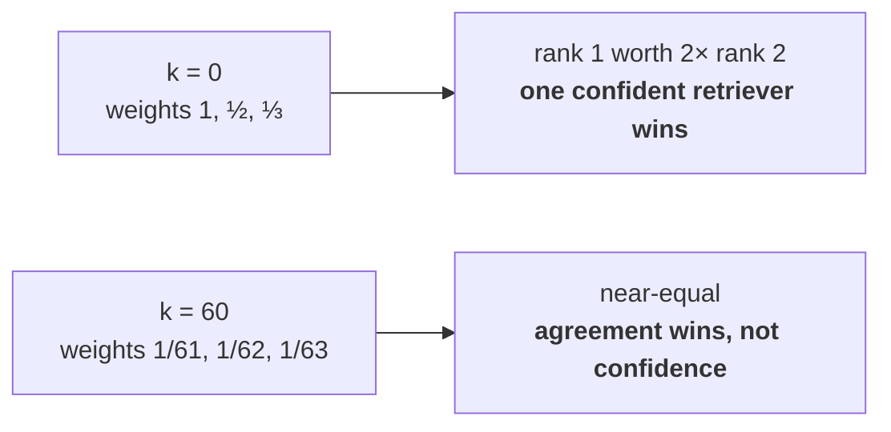

# L05 · Fuse two rankings without comparing their scores

🟢 **Easy** · 20 min · Track T3 — Ranking & Packing · after L03

---

## Look

The same query, two retrievers, top five each:

```text
BM25                       score      dense                     score
1  chunk-A                 18.4       1  chunk-C                 0.81
2  chunk-B                 15.1       2  chunk-A                 0.79
3  chunk-C                 14.8       3  chunk-F                 0.77
4  chunk-D                  9.2       4  chunk-B                 0.74
5  chunk-E                  8.8       5  chunk-G                 0.71
```

You need one list. The obvious move — add the scores — is not available: 18.4 and 0.81 are not
the same kind of number, and no amount of min-max scaling makes them one without labelled data
you do not have.

## Attribute

The deeper reason is worth holding on to, because it generalises past retrieval:

> **Any monotone transform of a retriever's scores leaves its ranking unchanged.** So the scores
> carry retriever-specific information that is not comparable across retrievers. The *ranking* is
> the only part that is.

That is the interpersonal-comparison-of-utility problem from social choice, and it has the same
answer here as there: use a **positional voting rule**.

$$
\text{RRF}(d) = \sum_{r \in R} \frac{1}{k + \text{rank}_r(d)}
$$



**`k` is a damping constant, not a free parameter.** At `k=60` the weights are nearly flat, so
what matters is *how many* retrievers ranked a document at all — which makes RRF a voting scheme
rather than a scoring one. That is the design intent.

### The decision

| | Fusion | Needs | Choose it when |
|---|---|---|---|
| **A** | RRF, `k=60` | nothing | You have no labelled data. Cannot be overfitted, survives score drift |
| **B** | Weighted `α·dense + (1−α)·lexical` | a labelled set to fit `α` | You have one, **and** one leg is materially stronger |
| **C** | Normalised score sum | calibration data | Rarely — the calibration drifts with the corpus |

**Default to A, then measure.** On *this* repo's corpus the measurement overrode the default —
weighted fusion at `α=0.2` beat RRF, because the dense leg is deliberately weak and an equal vote
drags the merge toward it. That is finding 1 in the README, and it is conditional on leg strength,
not a fact about RRF.

## Build

Implement `rrf` and `weighted_fusion` in `starter.py`. You need both to compare them.

```bash
python scripts/lab.py run L05
python scripts/lab.py run L05 --hidden
```

## Debrief

*Read after you pass.*

**Why `60`.** It has no derivation. It is an empirical constant from Cormack et al. (2009),
fitted on TREC, and the result is flat across roughly `30–120` — a sweep on this corpus moves
evidence recall by `+0.023` across the whole range, against `+0.061` for `α`. **If you are going
to tune one parameter it is not `k`.**

**The property that makes RRF worth the default.** A document ranked 3rd by *both* retrievers
beats one ranked 1st by one and 200th by the other. That is the behaviour you actually want from
a merge, and it is what a large `k` buys.

**When RRF loses.** Equal votes assume comparable competence. Measure per-leg recall by query
class before assuming it; if one leg fails everywhere the other does, fusion has little to offer
and you should fix the weak leg instead.

---

**Argued out in:** [#30](https://github.com/akash-coded/nanorag/discussions/30) ·
**Derivation:** [Reciprocal rank fusion](../../docs/30-learning/interview-prep/01-mathematical-foundations/reciprocal-rank-fusion.md) ·
**Next:** L06 — pack a prompt to a hard budget
