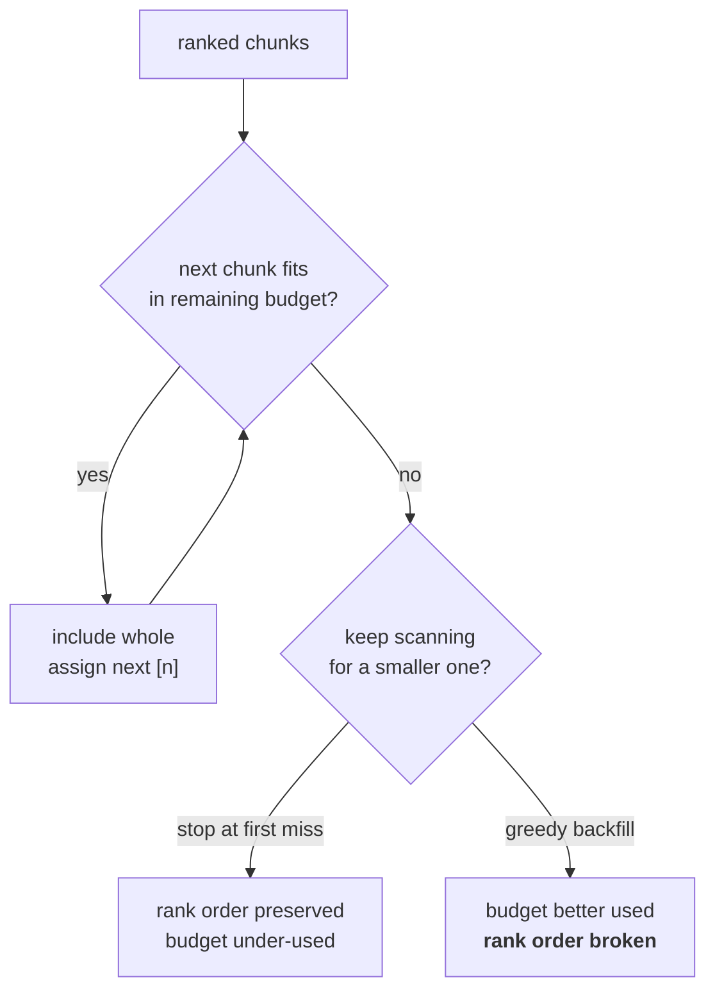

# L06 · Pack a prompt to a hard token budget

🟡 **Medium** · 25 min · Track T3 — Ranking & Packing · after L05

---

## Look

Eight ranked chunks, a 600-token budget, and two packers:

```text
                     packer A (truncate)        packer B (whole chunks)
chunks included      8 (one cut mid-sentence)   6
tokens used          600                        574
citations emitted    [1]..[8]                   [1]..[6]
citation [8] says    "...the excess is £500 pe" "-"
```

Packer A used the budget more completely and is the wrong answer.

Chunk 8 is truncated at 23 characters. The model still sees a source labelled `[8]`, still cites
it, and the citation points at a passage that **does not contain what the citation claims**. A
reader clicking through finds half a sentence. In a regulated setting that is not a quality
problem, it is a compliance one.

## Attribute

> **Whole chunks, dropped by rank. Never truncate mid-chunk — it breaks the citation.**

The budget is a constraint on how many *complete* units you can afford, not a character limit to
fill. Some slack is the correct outcome.



### The decision

| | Policy | Effect |
|---|---|---|
| **A** | Truncate to fill exactly | Best budget use, **broken citations** |
| **B** | Stop at the first chunk that does not fit | Simple, rank-faithful, leaves slack |
| **C** | Keep scanning and backfill smaller chunks | Better budget use; a rank-5 chunk can displace rank-4 |

**This lab builds B**, and the reason is not simplicity. Under C, whether a chunk appears depends
on the *sizes* of the chunks above it, so two runs on near-identical corpora can pack differently
and you cannot attribute a metric change to your reranker. **B keeps the packer boring so the
ranker stays measurable.**

C is defensible once you are optimising cost and have a stable ranker. It is the wrong default.

## Build

Implement `estimate_tokens` and `pack_context` in `starter.py`.

```bash
python scripts/lab.py run L06
python scripts/lab.py run L06 --hidden
```

## Debrief

*Read after you pass.*

**Citation numbers are positional, not identity.** `[1]` means "first in this packed context",
not "chunk 1". Two queries retrieving the same chunk in different positions must label it
differently, because the model can only refer to what it can see in *this* prompt.

**What the slack is worth.** Under B you will often leave 5–15% of the budget unused. That is not
waste — the alternative buys those tokens with either a broken citation (A) or an unattributable
metric (C). Name the number in your PR so the choice is visible.

**The next question this raises.** Now that `k` is effectively decided by the budget rather than
set directly, what happens to full-chain recall on multi-hop questions where both hops need to be
present? That is L07's territory, and the answer is that a global relevance ranking cannot express
a coverage constraint.

---

**Next:** L07 — the two recalls, and the gap between them
