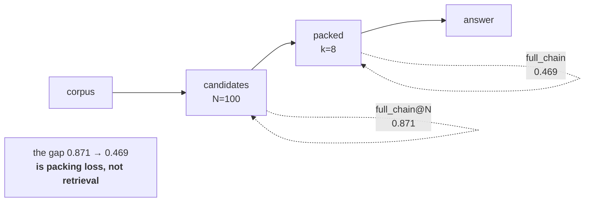

# L07 · The two recalls, and the gap between them

🟢 **Easy** · 20 min · Track T4 — Measurement · after L06

---

## Look

Someone widened the candidate pool from `N=100` to `N=400`. Real work, more retrieval calls, and
here is what happened:

```text
              Recall@N     full_chain_recall
N = 100          0.938            0.469
N = 400          0.974            0.481
```

Stage one improved. The thing anyone actually cares about did not.

## Attribute

They are not the same measurement and they do not share a denominator.

| Metric | Over what | Answers |
|---|---|---|
| `evidence_recall@k` | the **packed context** | what share of a question's gold evidence did the model see? |
| `full_chain_recall` | the **packed context** | did **every** gold item arrive? 1 or 0, no partial credit |
| `full_chain_recall_at_N` | the **candidate pool** | did stage one find all of it, before packing? |

`full_chain_recall` is a **conjunction**. A question needing three passages scores 1 only if all
three are packed. Widening `N` fills the pool; it does not create a ninth slot at `k=8`.



### The decision

Given the table above, where do you spend the next month?

| | Bet | What it assumes |
|---|---|---|
| **A** | Widen `N` further | The pool is still missing evidence |
| **B** | Raise `k` | The pool has it and the budget is the constraint |
| **C** | Better reranker | Ordering is wrong within the pool |
| **D** | **Measure which, first** | You do not yet know, and the metrics above cannot tell you apart |

**D**, and the diagnostic is four lines. On this corpus it found **84 questions where the evidence
reached the pool and did not survive packing**, against 27 never retrieved at all — a bottleneck
three-to-one on the stage nobody was working on.

## Build

Implement the three metrics and `found_then_dropped` in `starter.py`.

```bash
python scripts/lab.py run L07
python scripts/lab.py run L07 --hidden
```

## Debrief

*Read after you pass.*

**Why the conjunction is not `r^hops`.** Under independence, `0.938³ ≈ 0.825`. The measured
`full_chain_recall_at_N` is `0.871` — *higher*, because gold passages for one question often share
a document or entities, so retrieving one raises the chance of the next. Independence is a **lower
bound**, and the gap between bound and measurement is diagnostic in its own right: measured far
*below* the bound means something is actively suppressing the second hop, usually a
dedup-by-document rule.

**The general form, worth carrying past retrieval.** When a metric at stage *n* improves and the
metric at stage *n+1* does not, the bottleneck has moved. That is not a disappointment — it is the
measurement doing its job. It is [The Stage Gradient](../../docs/60-cheatsheets/frameworks/stage-gradient.md).

---

**Argued out in:** [#28](https://github.com/akash-coded/nanorag/discussions/28) ·
**Next:** L08 — the paired bootstrap
