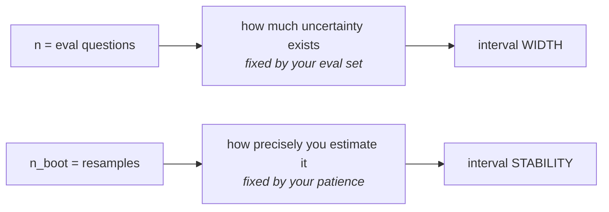

# L08 · Decide whether a delta is real

🟡 **Medium** · 30 min · Track T4 — Measurement · after L07

---

## Look

Your reranker change, measured on the same 207 questions:

```text
evidence_recall     delta +0.0334   CI [+0.0101, +0.0584]   real
full_chain_recall   delta +0.0338   CI [-0.0097, +0.0821]   inside the noise band
```

The point estimates are all but identical. The verdicts are opposite. Somebody in the review is
about to say *"so it works on one metric and not the other"*, and that is the wrong reading.

## Attribute

Both verdicts are correct, and they are **not two effects**. They are one effect measured at two
levels of statistical power.

`evidence_recall` is continuous over `{0, 0.5, 1.0}`. `full_chain_recall` is **binary per
question**, so its per-question variance is `p(1−p) ≈ 0.25` — about as large as it can be, and
maximal exactly at the 0.5 accuracy where interesting systems sit. The same true effect needs far
more questions to become visible on the binary metric.

**Why paired.** The quantity of interest is the per-question difference `dᵢ = Bᵢ − Aᵢ`, not the
difference of two means. Questions vary enormously in difficulty, and that variance usually dwarfs
the effect. Evaluating both arms on the **same questions** makes the covariance term large and
positive, and it cancels most of the difficulty variance out.



### The decision

Your interval is too wide. Which lever?

| | Move | Effect |
|---|---|---|
| **A** | Raise `n_boot` 2,000 → 100,000 | Endpoints stop wobbling in the 4th decimal. **Width does not change** |
| **B** | Grow the eval set | Width shrinks as `1/√n`. The only lever that works |
| **C** | Report the point estimate alone | Not a result |
| **D** | Re-run until it clears | Fraud with extra steps |

**B**, and the arithmetic is `n × (half_width / point_estimate)²`, then **doubled** — a delta that
only just missed significance is more likely than not an overestimate. That was measured here:
growing 207 → 812 questions moved a `+0.0338` delta to `+0.0116`.

## Build

Implement `paired_bootstrap` and `verdict` in `starter.py`.

```bash
python scripts/lab.py run L08
python scripts/lab.py run L08 --hidden
```

## Debrief

*Read after you pass.*

**Percentile intervals, and their limit.** You sorted the resampled deltas and took the 2.5th and
97.5th. That is the percentile method, and it is biased for skewed statistics; BCa corrects for
bias and acceleration and shifts the endpoints — **not reliably narrower**, and never enough to
rescue an underpowered comparison.

**Below about `n=100` the bootstrap itself gets thin.** You are resampling from very few distinct
outcomes on a binary metric, so the interval's *coverage* is off and it may not be a true 95%
interval at all. Wide is not the only failure mode; wrong is available too.

**"Inside the noise band" is a statement about your instrument**, not about your change. The
sentence to write is *"we cannot measure a difference at n=207"*, and the next move is usually to
grow the eval set — a day of generator work that beats every engineering option on the table.

---

**Derivation:** [Paired bootstrap and power](../../docs/30-learning/interview-prep/01-mathematical-foundations/paired-bootstrap-and-power.md) ·
**Argued out in:** [#29](https://github.com/akash-coded/nanorag/discussions/29) ·
**Next:** L09 — calibrate a judge
