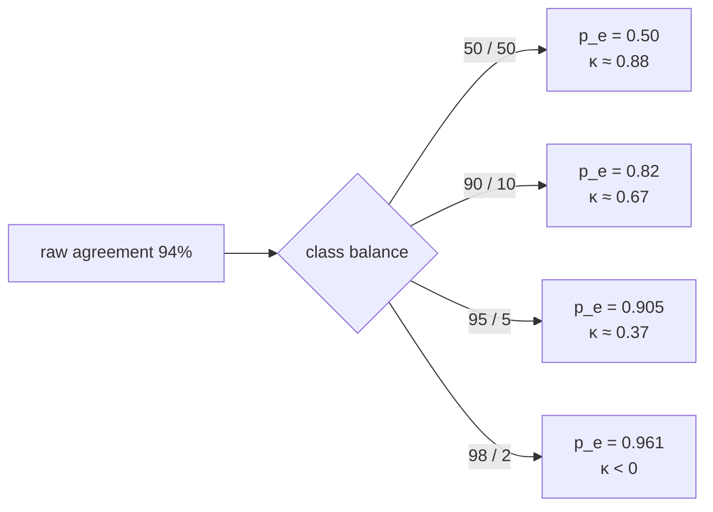

# L09 · Find out your judge agrees with you by accident

🟡 **Medium** · 25 min · Track T5 — Judgement · after L08

---

## Look

You hand-labelled 200 answers. The judge labelled the same 200. They agree on 188.

```text
                 judge: correct   judge: wrong
human: correct         176              3
human: wrong            9              12
```

**94% raw agreement.** It sounds like a working judge. Now notice that the judge says "correct"
90.5% of the time, and you say "correct" 89.5% of the time — so a judge that said **correct to
everything, always**, with no model behind it at all, would have agreed with you on 89.5%.

Almost all of that 94% was available for free.

## Attribute

Raw agreement is uninterpretable without the class balance. κ removes the part you would have got
by chance:

$$
\kappa = \frac{p_o - p_e}{1 - p_e}
$$

`pₑ` is expected agreement under independence, computed from the **marginals**: for each class,
multiply the two raters' rates of using it, and sum. The denominator `1 − pₑ` is the agreement
that was *available to be earned*, so κ is the share of it you actually earned.



**Same judge. Same 94%. Four different verdicts.** κ is a property of your label distribution as
much as of your judge, which is why a κ quoted without its base rate is not comparable to anyone
else's.

### The decision

Your judge scores κ = 0.61 on a 90/10 set. Do you use it to gate releases?

| | Answer | Reasoning |
|---|---|---|
| **A** | No, 0.61 is only "substantial" | Treats the Landis–Koch bands as a standard. They are a 1977 convention, and their own authors called the divisions arbitrary |
| **B** | Yes, for **relative** comparisons | A systematic bias applies to both arms of a paired comparison and cancels |
| **C** | Only after checking self-consistency | Same input twice, same verdict? An inconsistent judge adds noise to every measurement made with it |
| **D** | Only after checking **independence** | Is the judge's error correlated with what you are changing? |

**C then D then B.** The question that matters is not *"is κ high enough"* — it is **"is the
judge's error correlated with the thing I am trying to measure?"** A moderate but *consistent*
judge can rank two systems correctly. A high but *erratic* one cannot.

## Build

Implement `confusion`, `cohens_kappa` and `agreement_report` in `starter.py`.

```bash
python scripts/lab.py run L09
python scripts/lab.py run L09 --hidden
```

## Debrief

*Read after you pass.*

**Where κ is the wrong tool.** More than two raters → Fleiss' κ. Ordinal or graded rubrics →
*weighted* κ, so disagreeing by one grade costs less than by three; unweighted κ on a 1–5 rubric
throws away most of the information. Missing labels or mixed measurement levels → Krippendorff's
α, which degenerates to κ in the simple case.

**The prevalence paradox.** κ is itself sensitive to the marginals, so two rater pairs with
identical `pₒ` can have very different κ. Within one eval set tracked over time it is the right
statistic. **Across two different corpora it is not**, and comparing your κ to a published one is
usually meaningless.

**The house rule that follows.** Report κ with the base rate beside it. Always. An errata thread
already caught this repository quoting the Landis–Koch bands as if they were a threshold — see
[the errata category](https://github.com/akash-coded/nanorag/discussions/categories/q-a).

---

**Derivation:** [Cohen's κ](../../docs/30-learning/interview-prep/01-mathematical-foundations/cohens-kappa.md) ·
**Framework:** [The Calibration Triangle](../../docs/60-cheatsheets/frameworks/calibration-triangle.md) ·
**Next:** L10 — what the system actually costs
