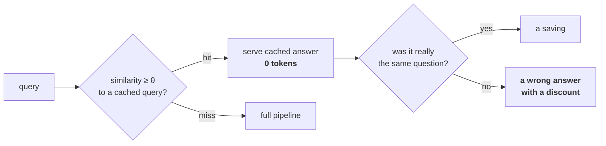

# L10 · Price the 69% of the bill that is not generation

🟡 **Medium** · 25 min · Track T6 — Economics · after L06

---

## Look

A client asks what a query costs. You have the token counts, so you answer: **about a cent.**

Here is the actual monthly bill:

```text
generation tokens                31%    <- the number you quoted
embedding, initial backfill      18%    one-off, and it lands in month one
embedding, re-embed on drift     14%    recurring, nobody asks about it
vector store / cluster           22%    fixed, does not scale down
reranker inference                9%
trace + eval storage              6%
```

You described **31%** with high confidence and implied the rest was rounding. That conversation
goes badly in month three, and it goes badly *because your number was accurate*.

## Attribute

Two shapes, blended into one per-query figure and thereby hidden:

| Shape | Items | Nature |
|---|---|---|
| **Capex-like** | backfill, index build, encoder upgrade | large, infrequent, plannable — a decision you make twice a year |
| **Opex-like** | generation, rerank, serving | continuous, scales with traffic — a bill you pay daily |

And then the cache, which looks like pure saving and is not.



### The decision

Where do you set the cache threshold θ?

| | Policy | Consequence |
|---|---|---|
| **A** | Maximise hit rate | Every false hit is a confidently wrong answer to a different question |
| **B** | Maximise F1 on hit/miss | Treats a false hit and a missed saving as equally bad. They are not |
| **C** | **Precision-first**: highest θ giving ≥99% precision on the hit class | Fewer hits, bounded harm. Report the resulting hit rate rather than choosing it |

**C.** The costs are asymmetric — a missed cache hit costs a fraction of a cent, a false hit costs
a wrong answer — so the operating point is chosen on precision and the hit rate is *reported*, not
targeted. Same argument as the sufficiency-check cascade in
[#35](https://github.com/akash-coded/nanorag/discussions/35).

## Build

Implement `query_cost`, `monthly_tco` and `pick_threshold` in `starter.py`.

```bash
python scripts/lab.py run L10
python scripts/lab.py run L10 --hidden
```

## Debrief

*Read after you pass.*

**The input nobody volunteers is change rate.** It drives the re-embed cycle, which is 14% here
and larger on a corpus that churns. Ask for it in the first meeting; you will not get it in the
fourth.

**A storage multiplier multiplies something worse.** Contextual chunking at 2.4× storage costs
fractions of a cent per GB-month — and 2.4× the tokens through the encoder on every backfill, a
bigger BM25 postings list in serving RAM, and a parent-document edit that now invalidates every
chunk in it. The dollars are a rounding error; **the coupling is not**, and it is invisible in
the storage column.

**The sentence that survives scrutiny.** *"Per-query token cost is around X and I can show you the
model. It is roughly a third of the total — the cluster and the re-embedding cycle dominate, and
both depend on facts about your corpus I do not have yet."*

---

**Framework:** [The Cost Iceberg](../../docs/60-cheatsheets/frameworks/cost-iceberg.md) ·
**Argued out in:** [#32](https://github.com/akash-coded/nanorag/discussions/32) ·
**Next:** L11 — a trace you can replay
