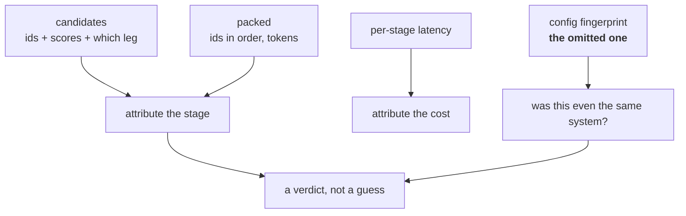

# L11 · Make a failure reproducible after the fact

🔴 **Hard** · 35 min · Track T7 — Agents & Traces · after L06, L07

---

## Look

A user reports a wrong answer from three weeks ago. You open the log:

```json
{"ts": "2026-08-11T09:14:02Z", "query": "flood excess?",
 "answer": "The excess is £500.", "latency_ms": 940}
```

Everything you need is missing. You cannot tell which of [the four
verdicts](../../docs/60-cheatsheets/frameworks/four-verdicts.md) this was, because you cannot see
what was retrieved, what survived packing, or what config produced it. The only honest answer to
"why did this happen" is *"I don't know, and I can't find out."*

## Attribute

> **A trace that records the answer is a log. A trace that records the decisions is evidence.**

A trace is replayable when someone who was not there can reconstruct **which stage failed** and
**whether the same inputs still produce the same output**. That needs four things, and the fourth
is the one everyone omits:



Without a config fingerprint you cannot distinguish *"the system is broken"* from *"the system
changed"* — and three weeks later those need very different responses.

### The decision

What goes in the trace, given storage is 6% of the bill and not free?

| | Policy | Consequence |
|---|---|---|
| **A** | Answer + latency | Cheap. Useless for attribution |
| **B** | Everything, including full chunk text | Complete, and your trace store is larger than your index |
| **C** | **Ids, scores, stage timings, config hash** | Attribution without duplication — chunk text is already in the index |
| **D** | C, sampled at 1% | Cheaper, and the failure a user reports is probably not sampled |

**C.** Store references, not copies. The one thing you *must* copy is the config, because the
config is the only part that will not still be there when you look.

## Build

Implement `config_fingerprint`, `build_trace` and `attribute` in `starter.py`.

```bash
python scripts/lab.py run L11
python scripts/lab.py run L11 --hidden
```

## Debrief

*Read after you pass.*

**`k_collapse` is the field that pays for itself.** It records how many candidates were dropped
between retrieval and packing. If a permission filter runs after retrieval, `k_collapse` is where
you see it — the user asked for 8 chunks and got 3, and no other field says so.

**Why a fingerprint and not the whole config.** The config can be long and mostly unchanging. An
8-character hash over the sorted config is enough to answer *"was this the same system?"*, which
is the only question you actually ask of it. Keep the full config once per fingerprint, elsewhere.

**The interview version of this lab.** When asked *"how would you debug a wrong answer in
production"*, the answer that scores starts with the trace fields and ends with **"and if there
is no trace, that is my first finding, not a blocker"**.

---

**Framework:** [The Four Verdicts](../../docs/60-cheatsheets/frameworks/four-verdicts.md) ·
**Next:** L12 — the release gate
