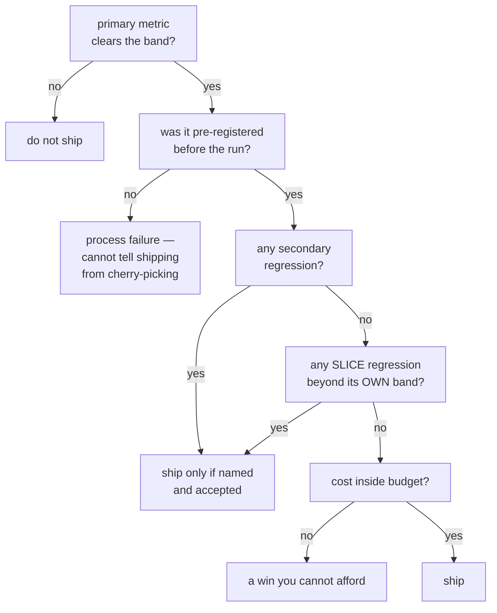

# L12 · Decide whether it ships

⚫ **Boss** · 50 min · Track T8 — Shipping · after L08, L09, L10, L11

> The capstone. Everything you built in T4–T7 feeds this one function, and its output is the
> artefact a release stage actually hands to the next person: **a decision record.**

---

## Look

A pull request arrives. The eval run says:

```text
metric                 delta      95% CI                verdict
evidence_recall       +0.0281   [+0.0164, +0.0402]     real          <- primary
full_chain_recall     +0.0116   [-0.0038, +0.0271]     band
context_precision     -0.0410   [-0.0655, -0.0166]     regression    <- secondary
answer_correct        +0.0090   [-0.0210, +0.0390]     band

slices (question_type)
  inference   n=88   +0.0350   [+0.0120, +0.0580]     real
  comparison  n=54   -0.0700   [-0.1180, -0.0220]     regression    <- a slice
  temporal    n=41   +0.0100   [-0.0500, +0.0700]     band
  null        n=24   +0.0000   [-0.0900, +0.0900]     band  (n too small)

cost   prompt tokens 4,090 -> 6,320  (+55%)
```

The primary metric cleared. Three other things did not. **Does it ship?**

## Attribute

Not a judgement call — a procedure, run in order, stopping at the first blocker.



Three things the gate has to get right, and each is a way real gates fail:

**Each slice needs its own band.** A slice of 24 has a far wider interval than the full set.
Applying the aggregate band to a small slice fails constantly on noise, and a gate that
false-positives gets disabled inside a week — **a disabled gate is worse than none, because it
still looks like a control.** Slices below a minimum size are *reported, not gated*, and the
report names which were skipped.

**"Inside the band" is not a regression.** It means *not measurable at this n*. A gate that
treats them the same blocks correct changes.

**Pre-registration is the whole defence.** From outside, "shipped on the primary metric" and
"picked the one that agreed with me" look identical.

### The decision

For the run above, what does your gate return? Commit before you code. The reference returns
**blocked**, on the `comparison` slice — `n=54` is above the minimum, and `-0.07` is a real
regression on a real question type, not noise.

## Build

Implement `slice_verdict`, `evaluate_gate` and `decision_record` in `starter.py`.

```bash
python scripts/lab.py run L12
python scripts/lab.py run L12 --hidden
```

## Debrief

*Read after you pass.*

**Watch the override rate.** If more than roughly one in ten blocked PRs is merged anyway after
review, your threshold is wrong — and the fix is almost always to **grow the eval set, not loosen
the gate**. Loosening it is how a control becomes decoration.

**A negative result is not a blocked release.** It is a release of a different kind: the change
does not ship, the *finding* does. The decision record is the deliverable either way, which is why
this function returns one whatever it decides.

**Multiple comparisons.** Testing 12 slices at α=0.05 gives you roughly one significant result by
chance. Before celebrating a single slice, apply Benjamini–Hochberg. And note the direction:
corrections apply to **significant** results — a null result does not need correcting, and
"isn't that multiple comparisons?" aimed at a non-significant finding is a misfire.

**What you just built is a PDLC artefact.** T1 gave you a corpus spec, T2 an ADR, T3 an
implementation with a measurement, T4 an eval set and its noise band, T5 a quality gate, T6 a cost
model, T7 a trace. T8 turns all of it into the one thing a release stage owes the next person: a
written decision, with the evidence attached, that somebody who was not in the room can audit.

---

**Playbook:** [Release gate](../../docs/60-cheatsheets/playbooks/release-gate-playbook.md) ·
**Decides:** [ADR-0008](../../docs/20-decisions/0008-eval-gate-in-ci.md)
